# HealthBooking System: Comprehensive Learning Guide

**Target Audience**: Junior developers (C#/.NET experience)  
**Duration**: 60-90 minutes read time  
**Goal**: Understand every architectural decision and how it's implemented in this distributed healthcare booking system

---

## Table of Contents

1. [System Overview](#system-overview)
2. [Clean Architecture per Service](#clean-architecture-per-service)
3. [Microservices Architecture](#microservices-architecture)
4. [Authentication: OIDC, OAuth2, and JWT](#authentication-oidc-oauth2-and-jwt)
5. [CQRS Pattern & MediatR Pipeline](#cqrs-pattern--mediatr-pipeline)
6. [Event-Driven Architecture](#event-driven-architecture)
7. [Domain-Driven Design (DDD) Concepts](#domain-driven-design-ddd-concepts)
8. [Observability & Telemetry](#observability--telemetry)
9. [API Contracts & Versioning](#api-contracts--versioning)
10. [System Integration Points](#system-integration-points)

---

## System Overview

### What Problem Does This System Solve?

The HealthBooking application is a **distributed healthcare appointment booking system**. Instead of building one monolithic application, we split it into independent services:

- **PatientService**: Manages patient registration, profiles
- **ProviderService**: Manages provider (doctor) profiles, availability
- **AppointmentService**: Orchestrates appointment bookings
- **NotificationService**: Sends emails after events
- **IdentityServer**: Handles authentication and authorization
- **API Gateway**: Single entry point for all clients

### Why Microservices?

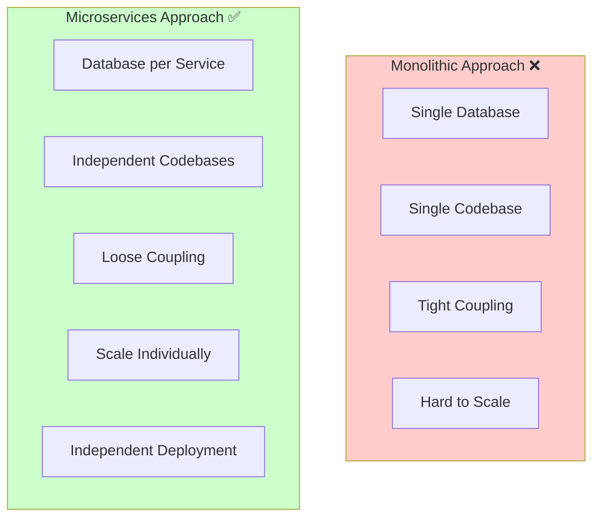

**Key Benefits**:
- **Independent Scaling**: Only book appointments during rush hours? Scale AppointmentService.
- **Technology Flexibility**: Each service can use different tech (we use .NET everywhere, but could mix)
- **Independent Deployment**: Deploy PatientService without affecting Appointment Service
- **Fault Isolation**: If NotificationService crashes, users can still book

---

## Clean Architecture per Service

Every service in this system follows **Uncle Bob's Clean Architecture**, which organizes code into layers with clear dependencies.

### The Four Layers

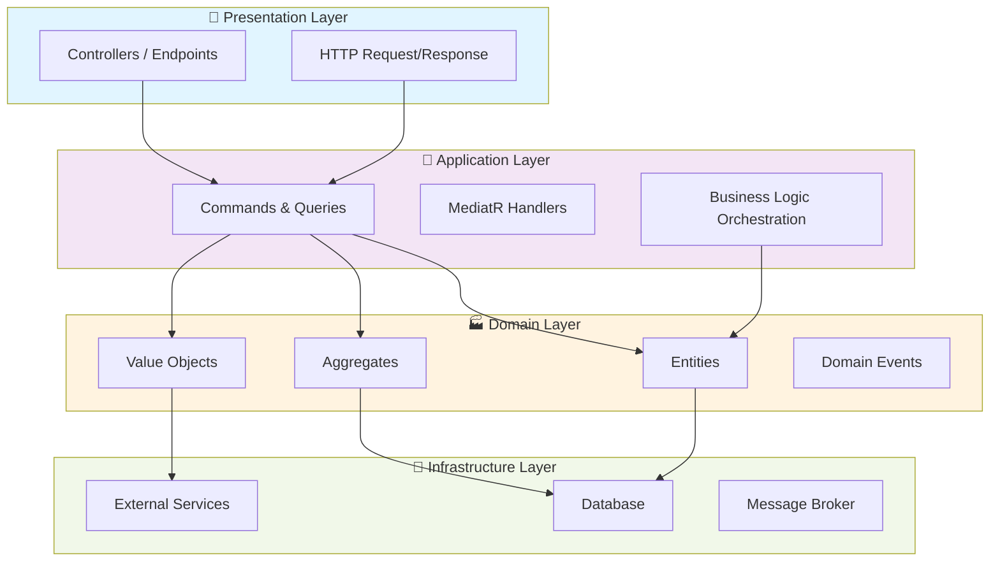

### Layer Responsibilities

**1. Presentation Layer** (Controllers/Endpoints)
- Accepts HTTP requests
- Converts requests to Commands/Queries
- Returns responses
- **Knows**: Application layer only
- **Does NOT know**: Database, domain entities

**2. Application Layer** (Commands, Queries, Handlers)
- Orchestrates business logic
- Executes MediatR handlers
- Validates requests
- **Knows**: Domain layer
- **Does NOT know**: HTTP, Database details

**3. Domain Layer** (Core Business Logic)
- Entity definitions (Patient, Provider, Appointment)
- Aggregates (collections of related entities)
- Value Objects (immutable objects like Email, PhoneNumber)
- Domain Events (BookingCompleted, AppointmentCancelled)
- **Knows**: Own rules only
- **Does NOT know**: Database, HTTP, external services

**4. Infrastructure Layer** (Database, External Services)
- Database operations (EF Core DbContext)
- Message publishing (MassTransit)
- External API calls
- **Implements**: Interfaces defined in Application layer

### Real Example: PatientService Layer Structure

```
src/Services/PatientService/
├── PatientService.API/
│   ├── Endpoints/
│   │   └── PatientsEndpoints.cs          ← Presentation Layer
│   ├── Program.cs
│   └── Dockerfile
│
├── PatientService.Application/
│   ├── Commands/
│   │   └── RegisterPatientCommand.cs     ← Application Layer
│   ├── Handlers/
│   │   └── RegisterPatientCommandHandler.cs
│   └── DTOs/
│       └── PatientDto.cs
│
├── PatientService.Domain/
│   ├── Entities/
│   │   └── Patient.cs                    ← Domain Layer
│   ├── ValueObjects/
│   │   ├── Email.cs
│   │   └── PhoneNumber.cs
│   └── Events/
│       └── PatientRegisteredEvent.cs
│
└── PatientService.Infrastructure/
    ├── Persistence/
    │   ├── PatientDbContext.cs           ← Infrastructure Layer
    │   └── Repositories/
    │       └── PatientRepository.cs
    └── Clients/
        └── IdentityProvisioningClient.cs
```

### Code Example: Patient Domain Entity

```csharp
// Domain Layer - PatientService.Domain/Entities/Patient.cs
using PatientService.Domain.ValueObjects;
using PatientService.Domain.Events;

public class Patient : AggregateRoot  // AggregateRoot = collection owner
{
    private Patient() { }  // EF Core constructor
    
    public Guid Id { get; private set; }
    public Email ContactEmail { get; private set; }
    public PhoneNumber PhoneNumber { get; private set; }
    public string FirstName { get; private set; }
    public string LastName { get; private set; }
    public DateOnly DateOfBirth { get; private set; }
    public DateTimeOffset RegistrationDate { get; private set; }
    
    // Factory method - only way to create a Patient
    public static Patient Register(
        string firstName,
        string lastName,
        string email,
        string phoneNumber,
        DateOnly dateOfBirth)
    {
        // Validate - Domain Rules
        if (string.IsNullOrWhiteSpace(firstName) || firstName.Length > 100)
            throw new ArgumentException("First name must be 1-100 chars");
        
        if (dateOfBirth >= DateOnly.FromDateTime(DateTime.UtcNow))
            throw new ArgumentException("DOB must be in the past");
        
        var patient = new Patient
        {
            Id = Guid.NewGuid(),
            FirstName = firstName.Trim(),
            LastName = lastName.Trim(),
            ContactEmail = new Email(email),      // Value Object validates
            PhoneNumber = new PhoneNumber(phoneNumber),
            DateOfBirth = dateOfBirth,
            RegistrationDate = DateTimeOffset.UtcNow
        };
        
        // Raise Domain Event
        patient.AddDomainEvent(
            new PatientRegisteredEvent(
                patient.Id,
                patient.FirstName,
                patient.LastName,
                patient.ContactEmail.Value
            )
        );
        
        return patient;
    }
    
    // Business Logic Method
    public void UpdateProfile(string firstName, string lastName, string phoneNumber)
    {
        FirstName = firstName.Trim();
        LastName = lastName.Trim();
        PhoneNumber = new PhoneNumber(phoneNumber);
    }
}
```

**Why This Structure?**
- **Single Responsibility**: Each layer has one reason to change
- **Testability**: Can test domain logic without database
- **Dependencies Flow Inward**: Presentation → Application → Domain ← Infrastructure
- **Easy to Mock**: Infrastructure is behind interfaces

---

## Microservices Architecture

### Service Communication Patterns

In a microservices system, services need to communicate. We use **three patterns**:

#### 1. Synchronous: REST/gRPC (Request-Response)

**When to use**: Need immediate response (user is waiting)

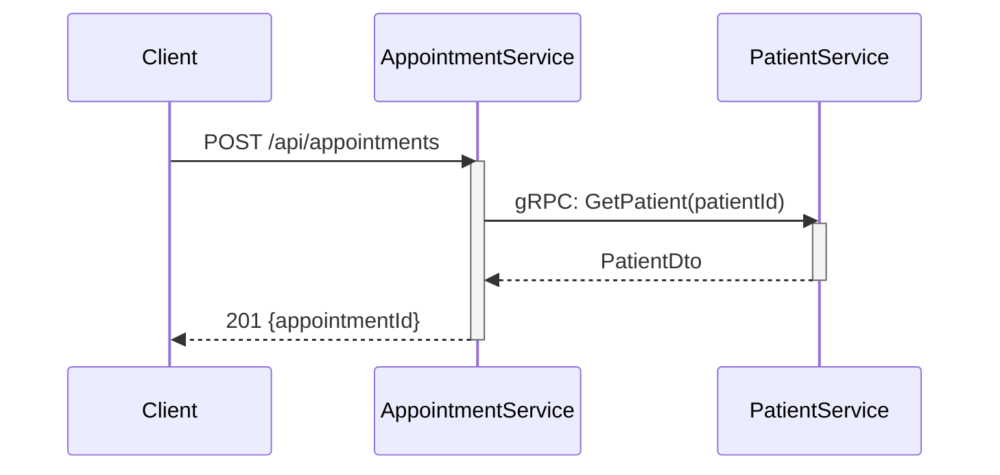

**Implementation in AppointmentService**:
```csharp
// Application Layer - Saga Activity
public class VerifyPatientActivity : Activity<V1_InitiateBookingCommand, PatientVerificationResult>
{
    private readonly PatientServiceClient _grpcClient;
    
    public async Task<PatientVerificationResult> Execute(
        ActivityExecutionContext<V1_InitiateBookingCommand> context)
    {
        var command = context.Arguments;
        
        // Synchronous gRPC call - blocks until response
        var patientRequest = new GetPatientRequest { PatientId = command.PatientId.ToString() };
        var patientResponse = await _grpcClient.GetPatientAsync(patientRequest);
        
        return new PatientVerificationResult
        {
            PatientId = command.PatientId,
            PatientName = patientResponse.PatientName
        };
    }
}
```

#### 2. Asynchronous: Message Broker (Fire-and-Forget)

**When to use**: Event happened, notify others, don't need immediate response

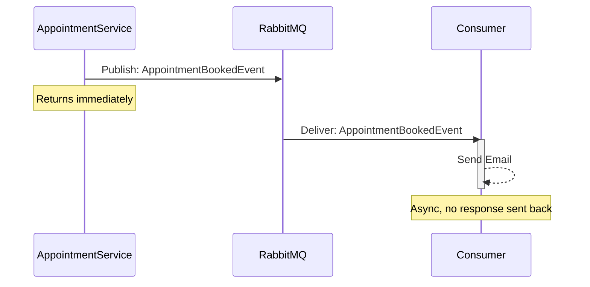

**Implementation in AppointmentService**:
```csharp
// Infrastructure Layer
public class OutboxMessageProcessor : IHostedService
{
    private readonly AppointmentDbContext _context;
    private readonly IPublishEndpoint _publishEndpoint;
    
    public async Task ProcessOutboxMessagesAsync()
    {
        var messages = await _context.OutboxMessages
            .Where(m => m.ProcessedTime == null)
            .ToListAsync();
        
        foreach (var message in messages)
        {
            var @event = JsonConvert.DeserializeObject(message.Content);
            
            // Publish to RabbitMQ via MassTransit
            await _publishEndpoint.Publish(@event);
            
            // Mark as processed
            message.ProcessedTime = DateTime.UtcNow;
            await _context.SaveChangesAsync();
        }
    }
}
```

#### 3. Saga Pattern: Long-running Distributed Transactions

**When to use**: Multi-step process across services with compensation

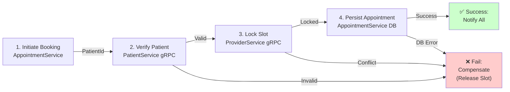

**BookingStateMachine Configuration**:
```csharp
// Application Layer - Saga State Machine
public class BookingStateMachine : MassTransitStateMachine<BookingState>
{
    public BookingStateMachine()
    {
        // Define states
        InstanceState(x => x.CurrentState);
        
        // Event: Command arrives
        Event(() => CommandReceived);
        
        // Initial state: Submitted
        Initially(
            When(CommandReceived)
                .Then(context => context.Instance.CorrelationId = Guid.NewGuid())
                .Activity(x => x.OfType<VerifyPatientActivity>())
                .TransitionTo(PatientVerified)
        );
        
        // After patient verified: lock slot
        During(PatientVerified,
            When(PatientVerified)
                .Activity(x => x.OfType<LockSlotActivity>())
                .TransitionTo(SlotLocked)
        );
        
        // After slot locked: persist appointment
        During(SlotLocked,
            When(SlotLocked)
                .Activity(x => x.OfType<PersistAppointmentActivity>())
                .TransitionTo(Completed)
        );
        
        // Compensation: If any step fails, release slot
        During(Uninitialized, PatientVerified, SlotLocked)
            .When(context => context.IsTimeout(RequestTimeout))
            .Publish(context => new V1_SlotReleasedEvent(...))
            .TransitionTo(Faulted);
    }
}
```

### Service-to-Service Communication: Direct Calls vs. Events

| Pattern | Sync gRPC | Async Events |
|---------|-----------|--------------|
| **When** | Need immediate response | Event notification |
| **Example** | Verify patient exists | Patient registered |
| **Coupling** | Tight (caller waits) | Loose (fire-forget) |
| **Latency** | Seconds | 50-200ms |
| **Failure** | Returns error | Retry + Dead Letter Queue |

---

## Authentication: OIDC, OAuth2, and JWT

### The Problem: How Do We Know Who You Are?

When a user logs in on the Angular frontend, they send credentials to IdentityServer. IdentityServer responds with a **JWT token**. Every subsequent request includes this token, proving the user is authenticated.

### OAuth2 Resource Owner Password Flow (ROPC)

**Step 1: Frontend sends credentials**
```
POST /connect/token
Content-Type: application/x-www-form-urlencoded

grant_type=password
&username=john@example.com
&password=mypassword
&client_id=patient-spa
&client_secret=patient-spa-secret
&scope=openid profile email offline_access healthbooking-api
```

**Step 2: IdentityServer verifies and issues tokens**
```
HTTP/1.1 200 OK
{
  "access_token": "eyJhbGc...",        ← Used for API calls
  "refresh_token": "eyJhbGc...",       ← Used to get new access_token
  "expires_in": 3600,                  ← 1 hour expiry
  "token_type": "Bearer"
}
```

**Step 3: Frontend includes token in every API request**
```
GET /api/appointments
Authorization: Bearer eyJhbGc...
```

### JWT: What's Inside the Token?

A JWT has three parts separated by dots: `header.payload.signature`

**Decoded example**:
```json
{
  "alg": "RS256",              ← Encryption algorithm
  "typ": "JWT"
}
.
{
  "sub": "550e8400-e29b-41d4-a716-446655440000",  ← Subject (user ID)
  "email": "john@example.com",
  "name": "John Doe",
  "scope": "openid profile email healthbooking-api",
  "aud": "appointment-service",  ← Who can use this token
  "exp": 1713607200              ← Expiration time (unix timestamp)
}
.
[cryptographic signature]
```

**Important**: The payload is **base64-encoded, not encrypted**. Anyone can read the claims. The signature just proves nobody modified it.

### How AppointmentService Validates Your Token

```csharp
// Infrastructure Layer - Startup (Program.cs)
builder.Services.AddAuthentication(JwtBearerDefaults.AuthenticationScheme)
    .AddJwtBearer(options =>
    {
        options.Authority = "http://localhost:5005";  // IdentityServer
        options.RequireHttpsMetadata = false;         // Dev only
        
        options.TokenValidationParameters = new TokenValidationParameters
        {
            ValidateAudience = true,
            ValidAudiences = ["appointment-service"]  // Only accept if aud = appointment-service
        };
    });
```

**What happens when you call an endpoint**:

```csharp
// Presentation Layer - Endpoint
app.MapPost("/api/appointments", async (HttpContext context, IRequestClient<V1_InitiateBookingCommand> client) =>
{
    // AuthMiddleware already validated the token at this point
    // `context.User` contains claims from the JWT
    
    var patientId = context.User.FindFirstValue(ClaimTypes.NameIdentifier);
    if (string.IsNullOrEmpty(patientId))
        return Results.Unauthorized();
    
    // Now we know who is making the request
    var command = new V1_InitiateBookingCommand { PatientId = Guid.Parse(patientId) };
    var result = await client.GetResponse<V1_BookingCompletedEvent>(command);
    
    return Results.Created();
})
.RequireAuthorization();  ← Only authenticated users
```

### OpenID Connect (OIDC) Layer

OIDC is built on top of OAuth2. It adds **identity claims** (who you are) on top of OAuth2's **authorization** (what you can do).

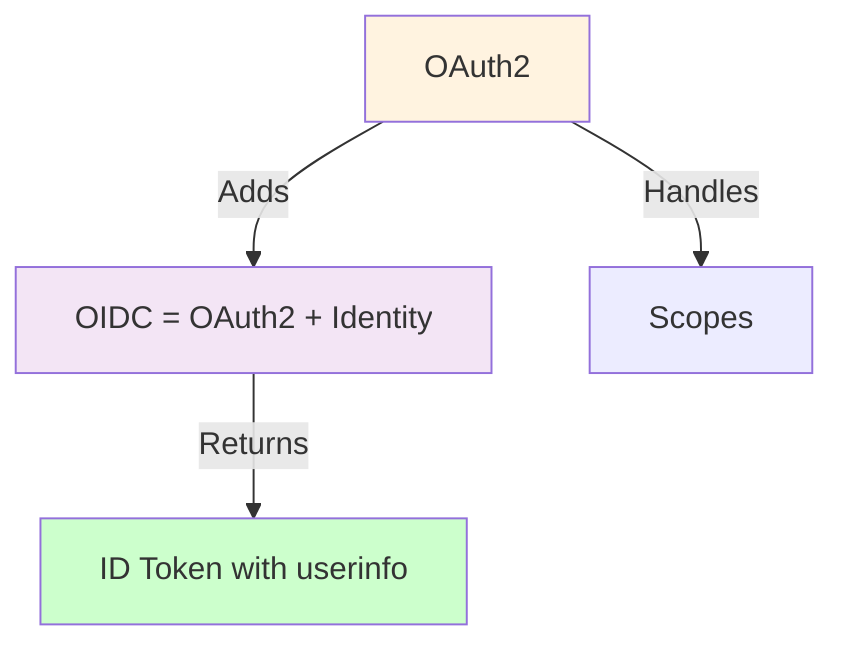

**Our IdentityServer config**:
```csharp
// Infrastructure Layer - IdentityServer/Config.cs
public static IEnumerable<ApiResource> GetApiResources()
{
    return new List<ApiResource>
    {
        new ApiResource("appointment-service")
        {
            Scopes = new[] { "appointment:read", "appointment:write" },
            UserClaims = new[] { "email", "given_name", "family_name" }
        },
        new ApiResource("patient-service")
        {
            Scopes = new[] { "patient:read", "patient:write" }
        }
    };
}

public static IEnumerable<Client> GetClients()
{
    return new List<Client>
    {
        new Client
        {
            ClientId = "patient-spa",
            ClientSecrets = new[] { new Secret("patient-spa-secret".Sha256()) },
            
            AllowedGrantTypes = GrantTypes.ResourceOwnerPassword,  // ROPC flow
            
            AllowedScopes = new[]
            {
                IdentityServerConstants.StandardScopes.OpenId,
                IdentityServerConstants.StandardScopes.Profile,
                IdentityServerConstants.StandardScopes.Email,
                IdentityServerConstants.StandardScopes.OfflineAccess,
                "appointment-service",
                "patient:read",
                "patient:write"
            }
        }
    };
}
```

### Token Refresh: When Access Token Expires

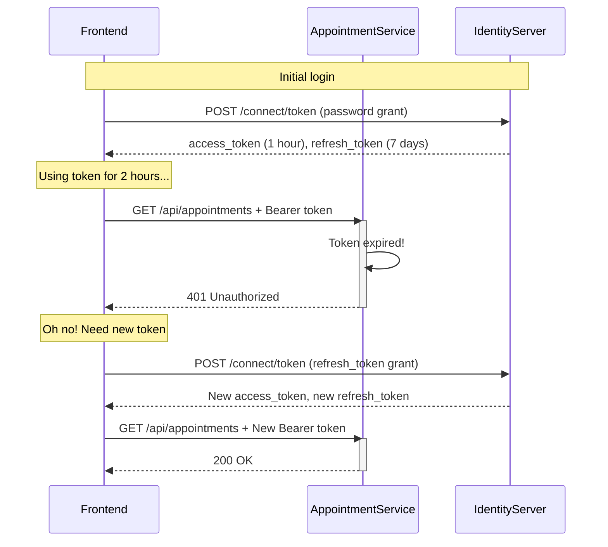

**Our AuthInterceptor handles this automatically**:
```csharp
// Infrastructure Layer - AuthInterceptor.ts (Frontend)
intercept(request, next) {
    const token = this.authService.getAccessToken();
    if (!token) return next.handle(request);
    
    request = request.clone({
        setHeaders: { Authorization: `Bearer ${token}` }
    });
    
    return next.handle(request).pipe(
        catchError(error => {
            if (error.status === 401) {
                // Token expired, refresh it
                return this.authService.refreshAccessToken().pipe(
                    switchMap(response => {
                        // Retry original request with new token
                        return next.handle(request.clone({
                            setHeaders: { Authorization: `Bearer ${response.access_token}` }
                        }));
                    })
                );
            }
            return throwError(() => error);
        })
    );
}
```

---

## CQRS Pattern & MediatR Pipeline

### What's CQRS?

**CQRS = Command Query Responsibility Segregation**

Instead of the typical Request → Service → Database → Response pattern, we split into:
- **Commands**: Requests that change data (Create, Update, Delete)
- **Queries**: Requests that read data (Get, list, search)

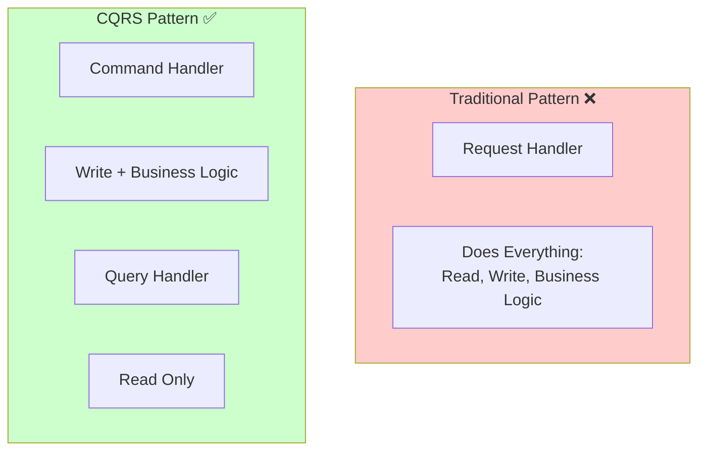

### Benefits of CQRS

| Benefit | Why? |
|---------|------|
| **Clarity** | Code intent is obvious (create vs. read) |
| **Scaling** | Read and write sides can scale independently |
| **Caching** | Queries can be heavily cached without invalidation issues |
| **Security** | Can apply different auth rules to commands vs. queries |
| **Testing** | Each handler has single purpose, easy to test |

### MediatR: Implementing CQRS

**MediatR** is a library that implements the **Mediator Pattern**. Instead of directly calling methods, you send messages through a mediator.

```csharp
// WITHOUT MediatR - Direct Calls ❌
public class PatientController
{
    private readonly IPatientRepository _repo;
    private readonly IIdentityClient _identity;
    private readonly IEmailService _email;
    
    public async Task<IActionResult> Register(RegisterRequest request)
    {
        // Controller does too much!
        var patient = new Patient(...);
        await _repo.AddAsync(patient);
        await _identity.ProvisionUserAsync(patient);
        await _email.SendWelcomeAsync(patient);
        return Ok();
    }
}

// WITH MediatR - Mediator Pattern ✅
public class PatientController
{
    private readonly ISender _sender;  // MediatR mediator
    
    public async Task<IActionResult> Register(RegisterRequest request)
    {
        var command = new RegisterPatientCommand(request.FirstName, ...);
        var result = await _sender.Send(command);
        return Created(result.PatientId);
    }
}
```

### MediatR Request Flow

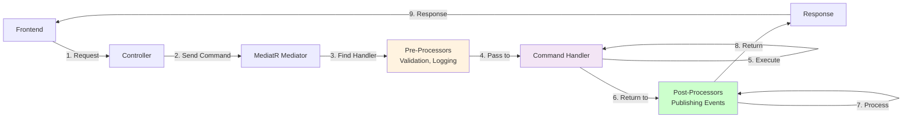

### Implementation Example: Book Appointment

**Step 1: Define the Command** (What we want to do)
```csharp
// Application Layer - Commands/BookAppointmentCommand.cs
public class BookAppointmentCommand : IRequest<BookAppointmentResult>
{
    public Guid SlotId { get; set; }
    public string IdempotencyKey { get; set; }
}

public class BookAppointmentResult
{
    public Guid AppointmentId { get; set; }
}
```

**Step 2: Create the Handler** (How to do it)
```csharp
// Application Layer - Handlers/BookAppointmentCommandHandler.cs
public class BookAppointmentCommandHandler : 
    IRequestHandler<BookAppointmentCommand, BookAppointmentResult>
{
    private readonly AppointmentDbContext _context;
    private readonly IRequestClient<V1_InitiateBookingCommand> _sagaClient;
    private readonly IPublisher _mediator;
    
    public async Task<BookAppointmentResult> Handle(
        BookAppointmentCommand request,
        CancellationToken ct)
    {
        // 1. Check idempotency (prevent duplicate bookings)
        var existing = await _context.BookingIdempotencyKeys
            .FirstOrDefaultAsync(k => k.Key == request.IdempotencyKey);
        
        if (existing != null)
            return new BookAppointmentResult { AppointmentId = existing.AppointmentId };
        
        try
        {
            // 2. Initiate saga (MassTransit orchestrates multi-service flow)
            var response = await _sagaClient.GetResponse<V1_BookingCompletedEvent>(
                new V1_InitiateBookingCommand { SlotId = request.SlotId }
            );
            
            // 3. Record idempotency key
            var idempotencyKey = new BookingIdempotencyKey
            {
                Key = request.IdempotencyKey,
                AppointmentId = response.Message.AppointmentId
            };
            _context.BookingIdempotencyKeys.Add(idempotencyKey);
            await _context.SaveChangesAsync(ct);
            
            // 4. Publish domain event (fires post-processor)
            await _mediator.Publish(
                new AppointmentBookedEvent(response.Message.AppointmentId)
            );
            
            return new BookAppointmentResult { AppointmentId = response.Message.AppointmentId };
        }
        catch (RequestTimeoutException)
        {
            throw new AppointmentBookingTimeoutException("Booking service unavailable");
        }
    }
}
```

**Step 3: Send Command from Controller**
```csharp
// Presentation Layer - Endpoints/AppointmentsEndpoints.cs
app.MapPost("/api/appointments", async (
    HttpContext context,
    BookAppointmentRequest request,
    ISender sender) =>
{
    var patientId = context.User.FindFirstValue(ClaimTypes.NameIdentifier);
    
    var command = new BookAppointmentCommand
    {
        SlotId = request.SlotId,
        IdempotencyKey = request.IdempotencyKey ?? Guid.NewGuid().ToString()
    };
    
    var result = await sender.Send(command);
    return Results.Created($"/api/appointments/{result.AppointmentId}", result);
})
.RequireAuthorization();
```

### MediatR Behaviors: The Pipeline

MediatR allows **Behaviors** - middleware-like components that wrap every request.

Think of it like ASP.NET middleware, but for MediatR:

```
Request → Validation Behavior → Logging Behavior → Error Handling Behavior → Handler → Response
```

**Example: Validation Behavior**
```csharp
// Application Layer - Behaviors/ValidationBehavior.cs
public class ValidationBehavior<TRequest, TResponse> : 
    IPipelineBehavior<TRequest, TResponse> 
    where TRequest : IRequest<TResponse>
{
    private readonly IEnumerable<IValidator<TRequest>> _validators;
    
    public async Task<TResponse> Handle(
        TRequest request,
        RequestHandlerDelegate<TResponse> next,
        CancellationToken ct)
    {
        if (!_validators.Any())
            return await next();  // No validators, proceed
        
        var validationResults = await Task.WhenAll(
            _validators.Select(v => v.ValidateAsync(request, ct))
        );
        
        var failures = validationResults
            .Where(r => r.Errors.Any())
            .SelectMany(r => r.Errors)
            .ToList();
        
        if (failures.Any())
            throw new ValidationException(failures);  // Fail fast
        
        return await next();  // All valid, proceed to handler
    }
}

// Register in DI
builder.Services.AddScoped(typeof(IPipelineBehavior<,>), typeof(ValidationBehavior<,>));
```

**Fluent Validators (Domain Rules)**
```csharp
// Application Layer - Validators/BookAppointmentCommandValidator.cs
public class BookAppointmentCommandValidator : AbstractValidator<BookAppointmentCommand>
{
    public BookAppointmentCommandValidator()
    {
        RuleFor(x => x.SlotId)
            .NotEmpty().WithMessage("Slot ID is required");
        
        RuleFor(x => x.IdempotencyKey)
            .NotEmpty().WithMessage("Idempotency key required");
    }
}
```

---

## Event-Driven Architecture

### The Problem CQRS Solves: Coupling

Imagine a method called `BookAppointment()`. After booking, you need to:
1. Send a confirmation email
2. Update provider's slot status
3. Log the action
4. Send push notification

```csharp
// ❌ Bad: Tight Coupling
public async Task BookAppointment(Appointment apt)
{
    await _appointmentRepo.SaveAsync(apt);
    await _emailService.SendConfirmationAsync(apt);      // Tightly coupled
    await _slotService.UpdateStatusAsync(apt.SlotId);   // Tightly coupled
    _logger.LogInformation("Appointment booked");        // Tightly coupled
    await _pushNotificationService.NotifyAsync(apt);    // Tightly coupled
}
```

**Problems**:
- If Email service is slow, booking is slow
- If Notification service crashes, entire booking fails
- Hard to add new behavior (add more awaits?)
- Can't re-use logic in other commands

### Solution: Domain Events

Instead, `BookAppointment()` publishes an event: "AppointmentBooked". Other services listen and react.

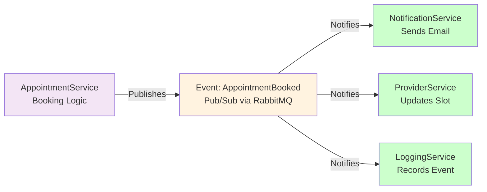

### Step 1: Define Domain Event

```csharp
// Domain Layer - Events/AppointmentBookedEvent.cs
public class AppointmentBookedEvent : DomainEvent
{
    public AppointmentBookedEvent(
        Guid appointmentId,
        Guid patientId,
        Guid providerId,
        DateTimeOffset scheduledTime)
    {
        AppointmentId = appointmentId;
        PatientId = patientId;
        ProviderId = providerId;
        ScheduledTime = scheduledTime;
        OccurredAt = DateTimeOffset.UtcNow;
    }
    
    public Guid AppointmentId { get; }
    public Guid PatientId { get; }
    public Guid ProviderId { get; }
    public DateTimeOffset ScheduledTime { get; }
    public DateTimeOffset OccurredAt { get; }
}
```

### Step 2: Raise Event from Aggregate

```csharp
// Domain Layer - Aggregates/Appointment.cs
public class Appointment : AggregateRoot
{
    public static Appointment Create(Guid patientId, Guid providerId, Slot slot)
    {
        var appointment = new Appointment
        {
            Id = Guid.NewGuid(),
            PatientId = patientId,
            ProviderId = providerId,
            SlotId = slot.Id,
            Status = AppointmentStatus.Booked,
            ScheduledStartUtc = slot.ToDateTimeUtc()
        };
        
        // Raise event - stored in aggregate, not persisted yet
        appointment.AddDomainEvent(
            new AppointmentBookedEvent(
                appointment.Id,
                patientId,
                providerId,
                appointment.ScheduledStartUtc
            )
        );
        
        return appointment;
    }
}
```

### Step 3: Persist and Publish (Outbox Pattern)

The **Outbox Pattern** ensures atomicity: Domain event and database write happen together.

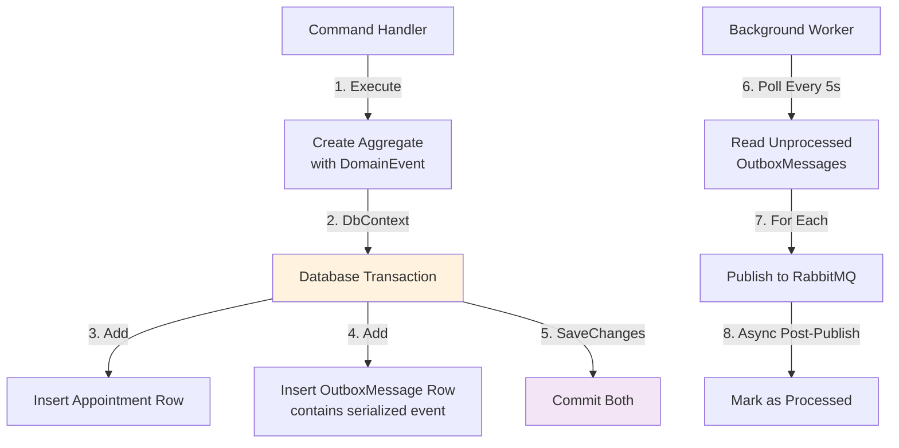

**Handler Implementation**:
```csharp
// Application Layer - Handler
public class BookAppointmentCommandHandler : IRequestHandler<BookAppointmentCommand, BookAppointmentResult>
{
    private readonly AppointmentDbContext _context;
    
    public async Task<BookAppointmentResult> Handle(...)
    {
        // 1. Create aggregate with event
        var appointment = Appointment.Create(patientId, providerId, slot);
        
        // 2. Add to database (event lives in aggregate)
        _context.Appointments.Add(appointment);
        
        // 3. SaveChanges triggers interceptor
        await _context.SaveChangesAsync();
        
        return new BookAppointmentResult { AppointmentId = appointment.Id };
    }
}
```

**SaveChanges Interceptor (pushes events to Outbox)**:
```csharp
// Infrastructure Layer - Persistence/DomainEventSaveChangesInterceptor.cs
public class DomainEventSaveChangesInterceptor : SaveChangesInterceptor
{
    public override async ValueTask<int> SavedChangesAsync(
        SaveChangesCompletedEventData eventData,
        InterceptionResult<int> result,
        CancellationToken ct)
    {
        var dbContext = eventData.Context;
        
        // Get all aggregates with domain events
        var aggregates = dbContext.ChangeTracker
            .Entries<AggregateRoot>()
            .Where(a => a.Entity.DomainEvents.Any())
            .ToList();
        
        var outboxMessages = aggregates
            .SelectMany(ae => ae.Entity.DomainEvents)
            .Select(de => new OutboxMessage
            {
                Id = Guid.NewGuid(),
                Type = de.GetType().Name,
                Content = JsonConvert.SerializeObject(de),
                CreatedAt = DateTime.UtcNow,
                ProcessedTime = null  // Not yet published
            })
            .ToList();
        
        await dbContext.OutboxMessages.AddRangeAsync(outboxMessages, ct);
        await dbContext.SaveChangesAsync(ct);  // Atomic save
        
        return await base.SavedChangesAsync(eventData, result, ct);
    }
}
```

### Step 4: Background Worker Publishes Events

```csharp
// Infrastructure Layer - Services/OutboxMessageProcessor.cs
public class OutboxMessageProcessor : BackgroundService
{
    private readonly IServiceProvider _serviceProvider;
    
    protected override async Task ExecuteAsync(CancellationToken stoppingToken)
    {
        while (!stoppingToken.IsCancellationRequested)
        {
            using (var scope = _serviceProvider.CreateScope())
            {
                var context = scope.ServiceProvider.GetRequiredService<AppointmentDbContext>();
                var publishEndpoint = scope.ServiceProvider.GetRequiredService<IPublishEndpoint>();
                
                // 1. Get unpublished messages
                var messages = await context.OutboxMessages
                    .Where(m => m.ProcessedTime == null)
                    .ToListAsync(stoppingToken);
                
                // 2. Publish each
                foreach (var message in messages)
                {
                    var @event = JsonConvert.DeserializeObject(message.Content, Type.GetType(message.Type));
                    await publishEndpoint.Publish(@event, stoppingToken);
                    
                    // 3. Mark as processed
                    message.ProcessedTime = DateTime.UtcNow;
                }
                
                // 4. Save
                await context.SaveChangesAsync(stoppingToken);
            }
            
            // Poll every 5 seconds
            await Task.Delay(5000, stoppingToken);
        }
    }
}
```

### Step 5: Other Services Subscribe

**In NotificationService**:
```csharp
// Infrastructure Layer - Consumers/AppointmentBookedEventConsumer.cs
public class AppointmentBookedEventConsumer : IConsumer<AppointmentBookedEvent>
{
    private readonly IEmailService _emailService;
    private readonly NotificationDbContext _context;
    
    public async Task Consume(ConsumeContext<AppointmentBookedEvent> context)
    {
        var @event = context.Message;
        
        // 1. Idempotency: Check if already processed
        var existing = await _context.NotificationLogs
            .FirstOrDefaultAsync(n => n.CorrelationId == @event.AppointmentId);
        
        if (existing != null)
            return;  // Already processed, idempotent
        
        // 2. Send email
        await _emailService.SendAsync(
            to: $"patient@example.com",
            subject: "Appointment Confirmed",
            body: $"Your appointment on {@event.ScheduledTime:f} is confirmed."
        );
        
        // 3. Log that we processed it (for idempotency)
        _context.NotificationLogs.Add(new NotificationLog
        {
            CorrelationId = @event.AppointmentId,
            EventType = nameof(AppointmentBookedEvent),
            ProcessedTime = DateTime.UtcNow
        });
        
        await _context.SaveChangesAsync();
    }
}

// Register in DI
services.AddMassTransit(x =>
{
    x.AddConsumer<AppointmentBookedEventConsumer>();
    x.UsingRabbitMq((context, cfg) =>
    {
        cfg.ConfigureEndpoints(context);
    });
});
```

### MassTransit: The Message Broker Integration

**MassTransit** is a .NET library that abstracts message brokers (RabbitMQ, Azure Service Bus, etc.).

```csharp
// Program.cs - Configuration
services.AddMassTransit(x =>
{
    // Define consumers
    x.AddConsumer<AppointmentBookedEventConsumer>();
    x.AddConsumer<AppointmentCancelledEventConsumer>();
    
    // Use RabbitMQ
    x.UsingRabbitMq((context, cfg) =>
    {
        cfg.Host("rabbitmq", 5672, h =>
        {
            h.Username("guest");
            h.Password("guest");
        });
        
        // Auto-create queues and exchanges
        cfg.ConfigureEndpoints(context);
    });
});
```

**Under the hood**, MassTransit:
1. Connects to RabbitMQ
2. Creates exchanges (for each event type)
3. Creates queues (one per consumer)
4. Sets up routing (event → consumer)
5. Handles serialization/deserialization
6. Implements retry logic automatically

---

## Domain-Driven Design (DDD) Concepts

### The Core Idea

**In complex business domains, code structure should mirror business reality.**

Don't think in terms of "Users", "Orders", "Products". Think like the business:
- **Patients** register and have appointments
- **Providers** manage availability and confirm appointments
- **Slotss** transition through states (Available → Locked → Booked)

### Ubiquitous Language

Everyone (developers, doctors, business analysts) uses the same vocabulary:

✅ **Do use**:
- "Patient", "Provider", "Appointment", "Slot"
- "Booking Saga", "Slot Lock", "Confirmation"
- "Idempotency Key"

❌ **Don't use**:
- "User" (too generic)
- "Entity" (every database table is an entity)
- "Object" (meaningless in business context)

### Strategic DDD: Bounded Contexts

**Bounded Context** = Microservice boundary. Everything in a context speaks the same language.

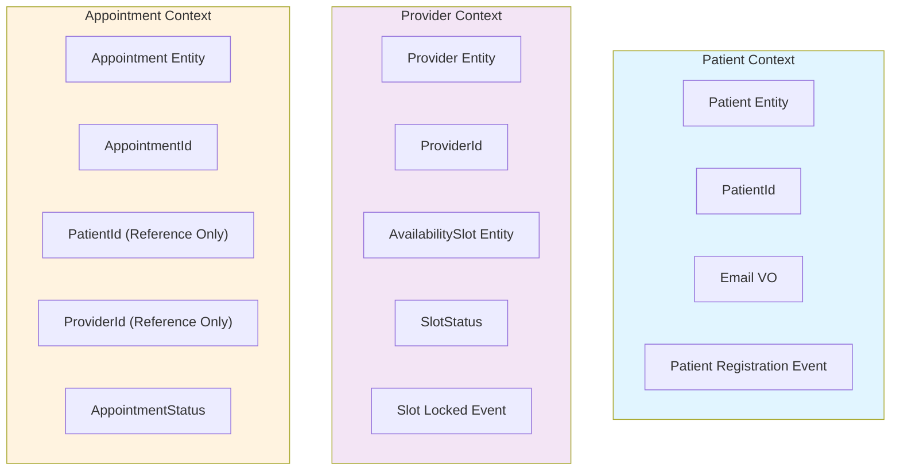

**Key Rule**: Each context has its own data. Never share database tables.

```csharp
// ❌ BAD: Direct reference (tight coupling)
public class Appointment
{
    public Patient Patient { get; set; }  // Reference to other context!
}

// ✅ GOOD: Only store ID
public class Appointment
{
    public Guid PatientId { get; set; }  // Just the ID, verify separately
}

// To verify patient exists:
var response = await _grpcClient.GetPatientAsync(appointment.PatientId);
```

### Tactical DDD: Building Blocks

#### 1. Entity (Has Identity)

```csharp
// Domain Layer - Entities/Patient.cs
public class Patient : AggregateRoot
{
    public Guid Id { get; private set; }  // Unique identity
    public Email ContactEmail { get; private set; }
    public string FirstName { get; private set; }
    
    // Two patients are equal if IDs match, even if other fields differ
    public override bool Equals(object obj)
    {
        if (obj is not Patient other) return false;
        return Id == other.Id;
    }
    
    public override int GetHashCode() => Id.GetHashCode();
}
```

#### 2. Value Object (No Identity, Immutable)

```csharp
// Domain Layer - ValueObjects/Email.cs
public sealed record Email
{
    public string Value { get; }
    
    public Email(string value)
    {
        if (string.IsNullOrWhiteSpace(value))
            throw new ArgumentException("Email required");
        
        if (!value.Contains("@") || !value.Contains("."))
            throw new ArgumentException("Invalid email format");
        
        Value = value.ToLower();  // Normalize
    }
    
    // VOs are compared by value, not identity
    public override bool Equals(object obj)
    {
        if (obj is not Email other) return false;
        return Value == other.Value;
    }
}

// Usage
var email1 = new Email("john@example.com");
var email2 = new Email("john@example.com");

email1 == email2;  // true (same value)
ReferenceEquals(email1, email2);  // false (different objects)
```

**Why Value Objects?**
- Encapsulate validation (invalid emails can never exist)
- Prevent misuse (can't accidentally pass phone number as email)
- Self-documenting (Email is clearer than string)

```csharp
// Domain Layer - ValueObjects/PhoneNumber.cs
public sealed record PhoneNumber
{
    public string Value { get; }
    
    public PhoneNumber(string value)
    {
        // E.164 format: +1 (US), 7-15 digits total
        if (!Regex.IsMatch(value, @"^\d{7,15}$"))
            throw new ArgumentException("Invalid phone format (E.164)");
        
        Value = value;
    }
}

// Now we're type-safe
public class Patient
{
    public Email Email { get; }
    public PhoneNumber Phone { get; }
}

// This is impossible:
var patient = new Patient
{
    Email = new Email("+1234567890"),  // Compile error! Email expects Email type
    Phone = new PhoneNumber("john@example.com")  // Compile error!
};
```

#### 3. Aggregate (Cluster of Entities + VOs)

An aggregate is a collection of related entities that are updated together. Think of it like a transaction boundary.

```csharp
// Domain Layer - Aggregates/Provider.cs
public class Provider : AggregateRoot  // Root of aggregate
{
    public Guid Id { get; private set; }
    public string FirstName { get; private set; }
    public string LastName { get; private set; }
    public SpecialtyName Specialty { get; private set; }
    
    // Child entity: Slots are ONLY accessible through Provider
    private List<AvailabilitySlot> _slots = new();
    public IReadOnlyList<AvailabilitySlot> Slots => _slots.AsReadOnly();
    
    // Business logic is in the aggregate root
    public void DefineDailyAvailability(DateOnly date, TimeOnly startTime, TimeOnly endTime)
    {
        if (endTime <= startTime)
            throw new InvalidOperationException("End time must be after start time");
        
        // Generate 30-minute slots
        var current = startTime;
        while (current < endTime)
        {
            var slotEnd = current.AddMinutes(30);
            if (slotEnd > endTime) break;
            
            _slots.Add(new AvailabilitySlot
            {
                Id = Guid.NewGuid(),
                Date = date,
                StartTime = current,
                EndTime = slotEnd,
                Status = SlotStatus.Available
            });
            
            current = slotEnd;
        }
        
        // Raise event
        AddDomainEvent(new AvailabilityDefinedEvent(Id, _slots.Count));
    }
    
    // Only the aggregate can modify its children
    public void LockSlot(Guid slotId, Guid appointmentId)
    {
        var slot = _slots.FirstOrDefault(s => s.Id == slotId)
            ?? throw new InvalidOperationException("Slot not found");
        
        if (slot.Status != SlotStatus.Available)
            throw new InvalidOperationException("Slot not available");
        
        slot.Lock(appointmentId);
        AddDomainEvent(new SlotLockedEvent(slotId, appointmentId));
    }
}

// Nested entity: Never accessed outside Provider
public class AvailabilitySlot
{
    public Guid Id { get; set; }
    public DateOnly Date { get; set; }
    public TimeOnly StartTime { get; set; }
    public TimeOnly EndTime { get; set; }
    public SlotStatus Status { get; set; }
    
    public void Lock(Guid appointmentId)
    {
        Status = SlotStatus.Locked;
    }
}
```

**Aggregate Rules**:
- Only load aggregates by ID from database
- Only store aggregate roots in repositories
- Aggregates only reference other aggregates by ID
- Modify aggregate as a unit (SaveChanges saves whole aggregate)

```csharp
// ✅ CORRECT: Load by ID, modify, save unit
var provider = await _providerRepository.GetByIdAsync(providerId);
provider.LockSlot(slotId, appointmentId);
await _providerRepository.SaveAsync(provider);  // Saves provider + all slots

// ❌ WRONG: Loading children separately
var slot = await _slotRepository.GetByIdAsync(slotId);  // Breaks encapsulation
slot.Status = SlotStatus.Locked;  // Bypasses business logic
await _slotRepository.SaveAsync(slot);
```

#### 4. Domain Event (Something Important Happened)

```csharp
// Domain Layer - Events/SlotLockedEvent.cs
public class SlotLockedEvent : DomainEvent
{
    public Guid SlotId { get; }
    public Guid AppointmentId { get; }
    public DateTimeOffset OccurredAt { get; }
    
    public SlotLockedEvent(Guid slotId, Guid appointmentId)
    {
        SlotId = slotId;
        AppointmentId = appointmentId;
        OccurredAt = DateTimeOffset.UtcNow;
    }
}

// Domain events describe business meaning, not implementation
// ✅ Good description: "SlotLockedEvent"
// ❌ Bad description: "DatabaseUpdateEvent"
```

### Invariants: Rules That Must Always Be True

```csharp
// Domain Layer - Business Rules
public class Appointment : AggregateRoot
{
    public AppointmentStatus Status { get; private set; }
    
    // INVARIANT: Can only confirm if currently Booked
    public void Confirm()
    {
        if (Status != AppointmentStatus.Booked)
            throw new InvalidOperationException(
                $"Cannot confirm {Status} appointment"
            );
        
        Status = AppointmentStatus.Confirmed;
    }
    
    // INVARIANT: Can only cancel if more than 2 hours before appointment
    public void Cancel(string reason)
    {
        if (DateTimeOffset.UtcNow.AddHours(2) > ScheduledStartUtc)
            throw new InvalidOperationException(
                "Cannot cancel within 2 hours of appointment"
            );
        
        Status = AppointmentStatus.Cancelled;
        CancelReason = reason;
    }
    
    // INVARIANT: Status transitions are limited
    // Booked → Confirmed → Completed
    // Booked → Cancelled (any time, with rules)
    // Confirmed → NoShow (by provider)
}
```

The database has no idea about these rules. A malicious script could violate them. But the aggregate protects them:

```csharp
// Application Layer - Can't violate invariants
var appointment = new Appointment { Status = AppointmentStatus.Confirmed };
appointment.Cancel(reason);  // FAILS: Can only cancel from Booked state

// Only way through:
appointment = Appointment.Create(...);  // Status = Booked
appointment.Confirm();
// Now Status = Confirmed
// appointment.Cancel() wouldn't throw
```

---

## Observability & Telemetry

### What is Observability?

**Observability** = Ability to understand system behavior by looking at outputs.

- **Logs**: Text records of events
- **Metrics**: Numeric measurements (request count, latency)
- **Traces**: Request flow through system

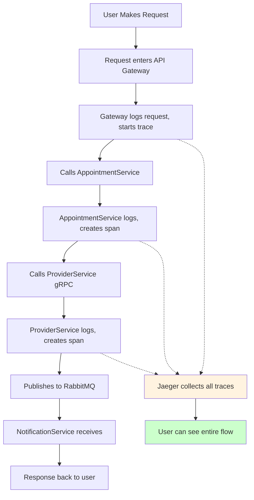

### OpenTelemetry (OTEL)

**OpenTelemetry** is the industry standard API for observability.

```csharp
// Infrastructure Layer - Program.cs Setup
var builder = WebApplicationBuilder.CreateBuilder(args);

// 1. Add OpenTelemetry
builder.Services.AddOpenTelemetry()
    // Metrics what was happening
    .WithMetrics(m => m
        .AddAspNetCoreInstrumentation()
        .AddHttpClientInstrumentation()
        .AddRuntimeInstrumentation()
        .AddOtlpExporter(o => o.Endpoint = new Uri("http://localhost:4317"))
    )
    // Traces requests
    .WithTracing(t => t
        .AddAspNetCoreInstrumentation()
        .AddHttpClientInstrumentation()
        .AddGrpcClientInstrumentation()
        .AddEntityFrameworkCoreInstrumentation()
        .AddOtlpExporter(o => o.Endpoint = new Uri("http://localhost:4317"))
    );

// 2. Configure activity source for custom spans
var serviceVersion = "1.0.0";
var serviceName = "AppointmentService";
builder.Services.AddSingleton(
    new ActivitySource(serviceName, serviceVersion));
```

### Creating Custom Traces

```csharp
// Application Layer - Handler
public class BookAppointmentCommandHandler : IRequestHandler<BookAppointmentCommand>
{
    private readonly ActivitySource _activitySource;
    
    public async Task Handle(BookAppointmentCommand request, CancellationToken ct)
    {
        using var activity = _activitySource.StartActivity("BookAppointment");
        activity?.SetAttribute("appointment.slotId", request.SlotId);
        
        using var patientLookup = _activitySource.StartActivity("VerifyPatient");
        patientLookup?.SetAttribute("patient.verificationTime", stopwatch.ElapsedMilliseconds);
        await _grpcClient.GetPatientAsync(request.PatientId);
        
        using var slotLocking = _activitySource.StartActivity("LockSlot");
        slotLocking?.SetAttribute("slot.lockStatus", "success");
        await _providerService.LockSlot(request.SlotId);
    }
}

// Jaeger receives trace:
/*
BookAppointment (root)
├── VerifyPatient
│   └── Duration: 45ms
├── LockSlot
│   └── Duration: 78ms
└── PersistAppointment
    └── Duration: 120ms
Total: 243ms
*/
```

### Jaeger: Visualizing Traces

Jaeger is the backend that collects, stores, and displays traces.

```
Request flow:
User → API Gateway (trace starts)
      → AppointmentService (span created)
      → ProviderService gRPC (span created)
      → RabbitMQ (span created)
      → NotificationService (span created)
      → Email sent (span created)

Jaeger shows you the ENTIRE flow with timings:

┌─ API Gateway [0ms]
│  └─ AppointmentService [5ms]
│     ├─ PatientService.GetPatient gRPC [10ms] ← took 40ms
│     └─ ProviderService.LockSlot gRPC [50ms] ← took 120ms
└─ RabbitMQ publish [170ms] ← instant
   └─ NotificationService.EmailConsumer [172ms] ← took 230ms
      └─ EmailService.Send [182ms] ← took 50ms
```

You can immediately see:
- Which service is slow
- Where time is being spent
- If something failures (red spans)

### Metrics vs. Traces

| Aspect | Logs | Metrics | Traces |
|--------|------|---------|--------|
| **Example** | `"User john@example.com logged in"` | `200 requests/sec` | Request flow through services |
| **Storage** | Text files (large) | Time-series DB (small) | Trace database |
| **When** | Debug specific issue | Understand trends | Diagnose specific request |
| **Ours** | Serilog | Prometheus | Jaeger/OTEL |

---

## API Contracts & Versioning

### The Problem: Frontend and Backend Out of Sync

```
Frontend sends:
{
  "slotId": "550e8400-e29b-41d4-a716-446655440000",
  "patientId": "550e8400-e29b-41d4-a716-446655440001"
}

Backend expects:
{
  "slotId": "...",
  "patientId": "..."
}

All good... until backend removes `patientId` field

Backend v2:
{
  "slotId": "..."
}

Frontend v1 still sends both, backend ignores patientId, no error

Later frontend changes:
{
  "slotId": "..."
}

But old backend v0 expected patientId too, returns 400 Bad Request ❌
```

### Solution: API Contracts (Shared Models)

Create a **contract** = shared understanding of request/response format.

We store these in `SharedKernel/HealthBooking.Contracts`:

```csharp
// SharedKernel - Contracts/Appointments/BookAppointmentRequest.cs
public class BookAppointmentRequest
{
    public Guid SlotId { get; set; }
    
    [JsonPropertyName("idempotencyKey")]
    public string IdempotencyKey { get; set; }
}

public class BookAppointmentResponse
{
    [JsonPropertyName("appointmentId")]
    public Guid AppointmentId { get; set; }
}
```

**Usage in Backend**:
```csharp
// AppointmentService - Endpoints
app.MapPost("/api/appointments",
    async (BookAppointmentRequest request, ISender sender) =>
    {
        var command = new BookAppointmentCommand
        {
            SlotId = request.SlotId,
            IdempotencyKey = request.IdempotencyKey
        };
        
        var result = await sender.Send(command);
        return Results.Created("", 
            new BookAppointmentResponse { AppointmentId = result.AppointmentId }
        );
    });
```

**Usage in Frontend** (TypeScript):
```typescript
// Import contract from shared package
import { BookAppointmentRequest, BookAppointmentResponse } from '@booking/contracts';

// Strongly typed
const request: BookAppointmentRequest = {
  slotId: appointmentId,
  idempotencyKey: uuid()
};

const response = await http.post<BookAppointmentResponse>(
  '/api/appointments',
  request
);
```

### Versioning: What to Do When Contract Changes

```
v1.0: { slotId, patientId }
v2.0: { slotId }  // Removed patientId

Problem: Old frontend sends patientId, new backend doesn't expect it
Solution: Make it optional, ignore it
```

**Change Pattern**:
1. **Add field**: Always optional with default
2. **Remove field**: Keep in code (ignore it) for 2+ releases
3. **Rename field**: Keep old name, map to new
4. **Change type**: Create new field, deprecate old

```csharp
public class BookAppointmentRequest
{
    public Guid SlotId { get; set; }
    
    [JsonPropertyName("patientId")]
    [Obsolete("Not needed, extracted from JWT")]
    public Guid? PatientId { get; set; }  // Optional, ignored
    
    [JsonPropertyName("idempotencyKey")]
    public string IdempotencyKey { get; set; }
}
```

### OpenAPI Specification

We document all contracts in OpenAPI format (Swagger):

```yaml
# specs/001-distributed-healthcare-system/contracts/appointments-v1.1-openapi.yaml
openapi: 3.0.0
info:
  title: HealthBooking Appointments API
  version: 1.1

paths:
  /api/appointments:
    post:
      summary: Book an appointment
      requestBody:
        required: true
        content:
          application/json:
            schema:
              $ref: '#/components/schemas/BookAppointmentRequest'
      responses:
        '201':
          description: Appointment created
          content:
            application/json:
              schema:
                $ref: '#/components/schemas/BookAppointmentResponse'
        '409':
          description: Slot unavailable (concurrent booking)

components:
  schemas:
    BookAppointmentRequest:
      type: object
      required:
        - slotId
      properties:
        slotId:
          type: string
          format: uuid
        idempotencyKey:
          type: string
          description: Prevents duplicate bookings

    BookAppointmentResponse:
      type: object
      properties:
        appointmentId:
          type: string
          format: uuid
```

Benefits:
- Frontend developers see exact format needed
- Auto-generateds client code (TypeScript, Java, Python)
- API documentation always stays in sync
- Testing tools can validate requests

---

## System Integration Points

### Complete Request Flow: User Books Appointment

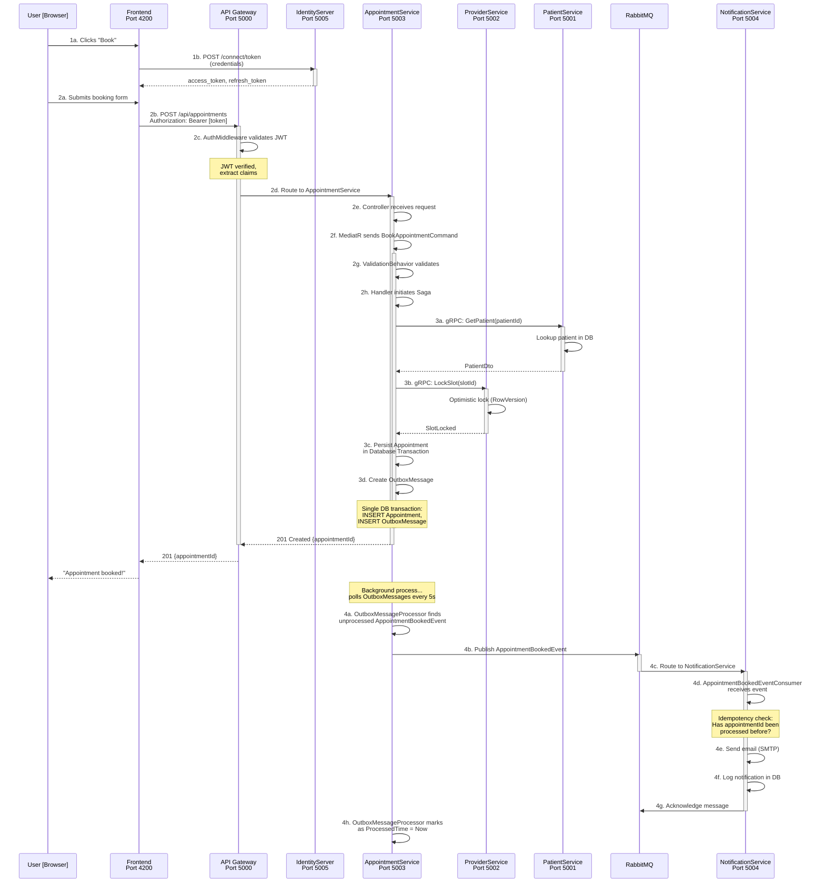

### Data Flow Example: Create Appointment

```csharp
// Step 1: User submits form from frontend
// POST http://localhost:4200/patient/appointments
// Body: { slotId: "uuid" }
// Header: Authorization: Bearer eyJhbGc...

// Step 2: Angular interceptor adds headers
// Authorization: Bearer [jwt_token]
// X-Correlation-Id: [uuid]

// Step 3: API Gateway receives (port 5000)
// GET http://localhost:5000/api/appointments
app.MapPost("/api/appointments", async (
    HttpContext context,
    BookAppointmentRequest request,
    ISender sender
) =>
{
    // Step 4: Middleware validates JWT
    var token = context.Request.Headers["Authorization"].ToString().Replace("Bearer ", "");
    var claims = JwtBearerDefaults.ValidateToken(token);
    var patientId = claims.FindFirst(ClaimTypes.NameIdentifier)?.Value;
    
    // Step 5: Create MediatR command
    var command = new BookAppointmentCommand
    {
        PatientId = Guid.Parse(patientId),
        SlotId = request.SlotId,
        IdempotencyKey = request.IdempotencyKey
    };
    
    // Step 6: Send through MediatR pipeline
    var result = await sender.Send(command);
    
    return Results.Created($"/api/appointments/{result.AppointmentId}", result);
})
.RequireAuthorization();

// Step 7: MediatR finds handler
// AppointmentService.Application/Handlers/BookAppointmentCommandHandler.cs
public class BookAppointmentCommandHandler : IRequestHandler<BookAppointmentCommand, BookAppointmentResult>
{
    public async Task<BookAppointmentResult> Handle(BookAppointmentCommand request, CancellationToken ct)
    {
        // Step 8: Check idempotency
        var existing = await _context.BookingIdempotencyKeys
            .FirstOrDefaultAsync(k => k.Key == request.IdempotencyKey);
        if (existing != null)
            return new BookAppointmentResult { AppointmentId = existing.AppointmentId };
        
        // Step 9: Initiate Saga
        var sagaClient = scope.ServiceProvider.GetRequiredService<IRequestClient<...>>();
        var response = await sagaClient.GetResponse<V1_BookingCompletedEvent>(
            new V1_InitiateBookingCommand { ... },
            timeout: TimeSpan.FromSeconds(30)
        );
        
        // Step 10: Record idempotency
        _context.BookingIdempotencyKeys.Add(
            new BookingIdempotencyKey { Key = request.IdempotencyKey, ... }
        );
        
        // Step 11: Raise domain event
        var appointment = Appointment.Create(...);
        _context.Appointments.Add(appointment);
        
        // Step 12: SaveChanges - triggers interceptor
        await _context.SaveChangesAsync(ct);
        // Interceptor:
        // - Extracts domain events from aggregate
        // - Creates OutboxMessages
        // - Saves both in ONE transaction
        
        return new BookAppointmentResult { AppointmentId = response.Message.AppointmentId };
    }
}

// Step 13: Background service polls OutboxMessages
// Every 5 seconds:
var unprocessedMessages = await _context.OutboxMessages
    .Where(m => m.ProcessedTime == null)
    .ToListAsync();

foreach (var message in unprocessedMessages)
{
    var @event = JsonConvert.DeserializeObject(message.Content);
    
    // Step 14: Publish to RabbitMQ
    await _publishEndpoint.Publish(@event);
    
    message.ProcessedTime = DateTime.UtcNow;
    await _context.SaveChangesAsync();
}

// Step 15: NotificationService consumes event
public class AppointmentBookedEventConsumer : IConsumer<AppointmentBookedEvent>
{
    public async Task Consume(ConsumeContext<AppointmentBookedEvent> context)
    {
        var @event = context.Message;
        
        // Idempotency: Check if already processed
        var exists = await _db.NotificationLogs
            .FirstOrDefaultAsync(n => n.CorrelationId == @event.AppointmentId);
        if (exists != null) return;
        
        // Send email
        await _smtp.SendAsync(new MailMessage { ... });
        
        // Log for idempotency
        _db.NotificationLogs.Add(new NotificationLog { ... });
        await _db.SaveChangesAsync();
    }
}

// Step 16: Response sent back to frontend
// 201 Created
// { "appointmentId": "550e8400-..." }

// Step 17: Frontend displays confirmation
// "Your appointment has been booked! Confirmation email sent."
```

---

## Summary: How It All Works Together

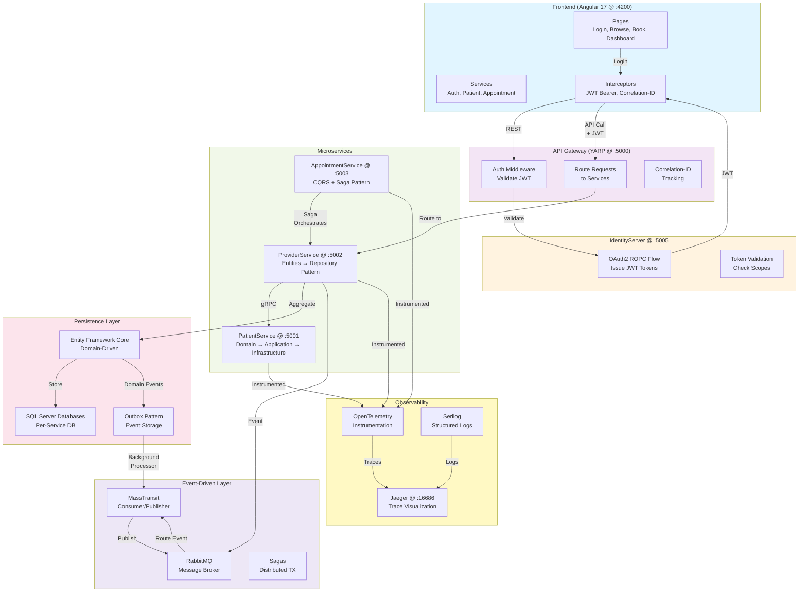

---

## Key Takeaways for Junior Developers

### 1. **Architecture Matters**
- Clean Architecture keeps code testable and maintainable
- Microservices allow independent scaling and deployment
- DDD makes code reflect business reality

### 2. **Patterns Solve Real Problems**
- CQRS separates reads and writes (scaling, caching)
- Sagas handle distributed transactions
- Outbox Pattern ensures event reliability
- gRPC for sync calls, RabbitMQ for async events

### 3. **Security is Built-In**
- OAuth2/OIDC manages authentication
- JWT tokens prove identity
- Scopes control what users can do
- Interceptors enforce policies transparently

### 4. **Observability is Essential**
- Never debug a microservices system without tracing
- OpenTelemetry/Jaeger shows request flow
- Logs answer "what happened?"
- Metrics answer "is it slow?"

### 5. **Contracts Prevent Misunderstandings**
- Shared models between frontend/backend
- API versioning prevents breaking changes
- OpenAPI spec documents everything

### 6. **Testing is Straightforward**
- Domain layer has no dependencies (easy unit tests)
- Handlers have single purpose (easy to mock)
- Interfaces separate concerns (dependency injection)

---

## Questions to Ask Before Reading

- What patterns would benefit each layer of my service?
- Why would I use gRPC instead of REST?
- How do I add a new event consumer?
- What happens if the email service is down?
- How do I prevent double-bookings?

**Read this guide with a specific problem in mind. Architecture isn't abstract—it solves real engineering challenges.**

---

**Last Updated**: April 20, 2026  
**Target Level**: Junior C#/.NET Developer  
**Reading Time**: 60-90 minutes  
**Implementation Focus**: Understanding over code memorization
